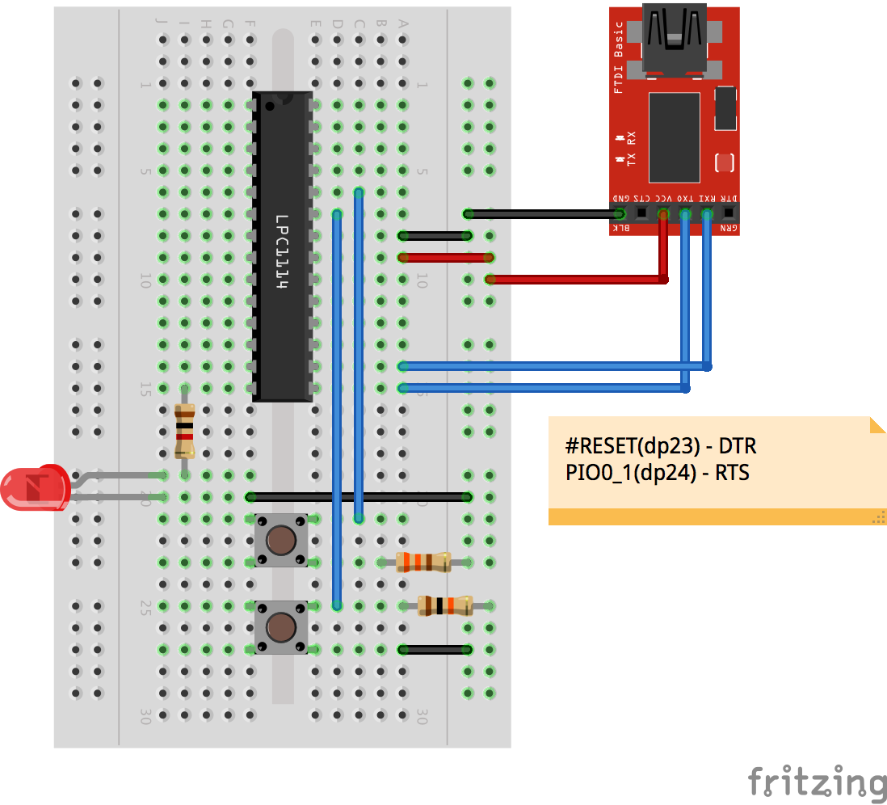

# LPC1114FN28

USB serial を使って、LPC1114FN28 に書き込む

[lpc21isp](https://sourceforge.net/projects/lpc21isp/)

| USB Serial | LPC1114FN28  |
|:-----------|:-------------|
| RTS        | PIO0_1(dp24) |
| DTR        | #RESET(dp23) |
| GND        | VSS(dp22)    |
| 3V3        | VDD(dp21)    |
| RXD        | TXD(dp16)    |
| TXD        | RXD(dp15)    |

## プロジェクトの作成

```
$ platformio init --board=lpc1114fn28
```

## コード

src/main.cpp

```
#include "mbed.h"

DigitalOut myled(LED1);

int main() {
    while(1) {
        myled = 1;
        wait(0.5);
        myled = 0;
        wait(0.5);
    }
}
```

## 書き込み

USB シリアルのデバイスを確認(macOS)

```
ls /dev/tty.usbserial*
```

バイナリイメージを書き込む

```
lpc21isp -control -bin .pioenvs/lpc1114fn28/firmware.bin \
    /dev/tty.usbserial-A601FBW8 115200 48000
```

## ブレッドボード

[fritzing](http://fritzing.org/home/)



# 参考URL

[platformio - LPC1114](https://lowreal.net/2016/02/17/3)
